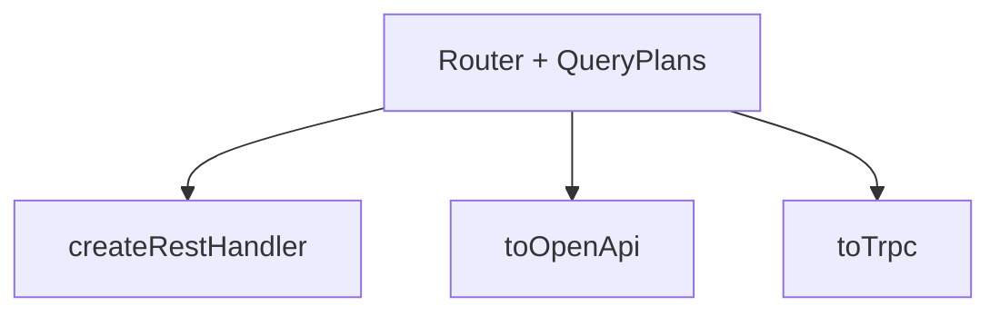

`toTrpc(router)` turns your routes into tRPC-style procedures. Same `QueryPlan`
source, typed end to end.

## Generate procedures

```ts
import { toTrpc } from "@mountsqli/api";

const procedures = toTrpc(router);
// → [{ path, resolver }] ready to mount on a tRPC router
```

## How it fits



One router, three transports. The plan is the contract; REST, OpenAPI, and RPC
are different surfaces over it.

## Real-world example

```ts
const router = createRouter();
router.get("/users", { plan: db.from(users)._plan });

export const appRouter = trpc.router({
  users: trpc.procedure.query(() => {
    const [proc] = toTrpc(router).filter((p) => p.path === "users");
    return proc.resolver(/* ctx */);
  }),
});
```

## Best practices

- Keep one `Router` as the API source of truth.
- Reuse the same plans across REST and RPC for consistency.
- Validate inputs with `ValidationShape` before resolving.

## Common mistakes

- Maintaining separate REST and RPC route definitions (drift) — derive both from one router.

## Related

- [Overview](/api/overview/) — the Router model.
- [OpenAPI & Codegen](/api/openapi/) — the REST spec sibling.
