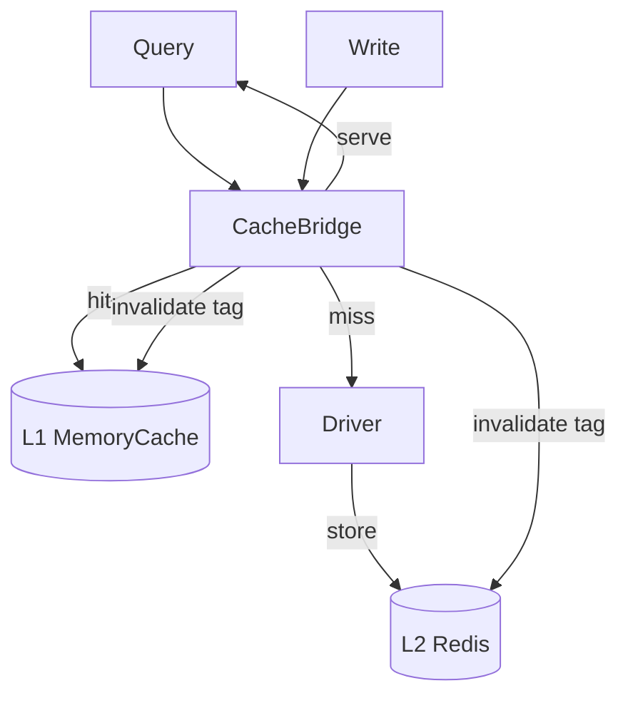

The caching layer reduces database load by caching query results. It is opt-in
and wired through the `CacheBridge`.

## Where it sits

## Read path

On a read, the bridge builds a cache key from the plan (`buildCacheKey`), checks
L1, then L2. On a miss it queries the driver and stores the result in both
layers.

## Write path

After a write, `invalidateAfterWrite(plan)` drops every cache entry tagged with
the affected table, so reads stay correct.

## Analyzer gate

The `QueryCacheAnalyzer` decides cacheability from the plan: `SELECT`s are
cached; writes are not. This keeps the cache correct by default.

## Best practices

- Use L2 (Redis) in multi-instance deployments so invalidation propagates.
- Always route writes through the bridge's invalidation.
- Size L1 to your working set.

## Common mistakes

- Caching writes (the analyzer blocks this, but don't force it).
- Forgetting invalidation on write → stale data.

## Related

- [Cache → Overview](/cache/overview/) — the user guide.
- [Tags & Invalidation](/cache/tags/) — how invalidation works.
