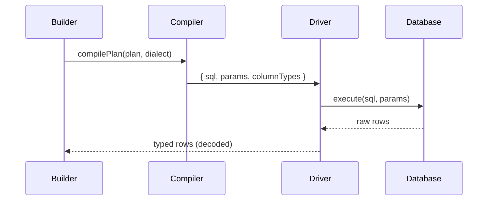

Execution is the path from a builder call to typed rows. It has four steps.

## The flow

## Steps

1. **Compile** — `compilePlan(plan, dialect)` → `{ sql, params, columnTypes }`.
2. **Bind** — the driver sends SQL + params to the database.
3. **Run** — the database returns rows (driver-agnostic).
4. **Decode** — the driver uses `columnTypes` to decode values (e.g. `0/1` →
   `boolean`) back into the `InferTable` shape.

## Why decode at the driver

The plan carries `columnTypes`, so the driver knows `bool` columns should become
`boolean` even though the DB stored `0`/`1`. Your app never sees the raw form.

## Immutability along the way

The builder forks a new plan per method; the compiled output is also derived,
never mutated. This is why concurrent queries don't interfere.

## Best practices

- Await terminal methods (`all`, `findOne`, `insert`, …) — that's when execution happens.
- Let the driver decode types; don't re-cast in app code.

## Common mistakes

- Calling builder methods and expecting execution (only terminals run).
- Assuming `bool` returns `0`/`1` (the driver decodes it).

## Related

- [Compiler & Dialects](/architecture/compiler/) — the compile step.
- [Type-Safety System](/architecture/type-safety/) — the decoded row type.
