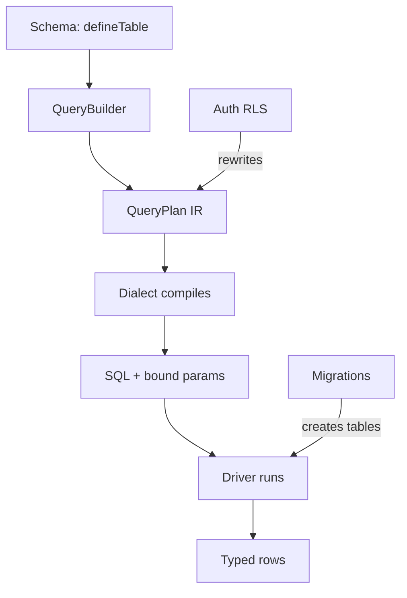

MountSQLI's defining bet: **the ORM is a compiler + an intermediate
representation, not a class hierarchy.** This page is the mental model for
everything else.

## The pipeline

## Why a compiler?

- **Tree-shakeable** — unused query features drop from the bundle.
- **Edge-ready** — the plan is data; no heavy object graph per query.
- **Near-zero allocation** — queries are immutable structs, not live objects.
- **One validator** — the builder, the AI, and RLS all produce/consume plans.

## The IR is the contract

Every subsystem speaks `QueryPlan`:

- The builder **produces** it.
- The dialect **compiles** it.
- RLS **rewrites** it (injects filters).
- The Studio **inspects** it.
- The AI **emits** it.

## Immutable by construction

Builder methods fork a new plan; they never mutate `this`. This is why
`returning()` on a transaction builder is safe, and why plans can be shared and
rewritten without side effects.

## Best practices

- Think in plans, not rows or models.
- Let the dialect own SQL differences between databases.
- Keep RLS in policies so it compiles into the plan.

## Common mistakes

- Assuming `where()` runs SQL immediately (it builds a plan).
- Putting auth checks in handlers instead of RLS policies.

## Related

- [QueryPlan IR](/architecture/queryplan/) — node types.
- [Compiler & Dialects](/architecture/compiler/) — `compilePlan`.
- [Query Execution](/architecture/execution/) — plan → rows.
