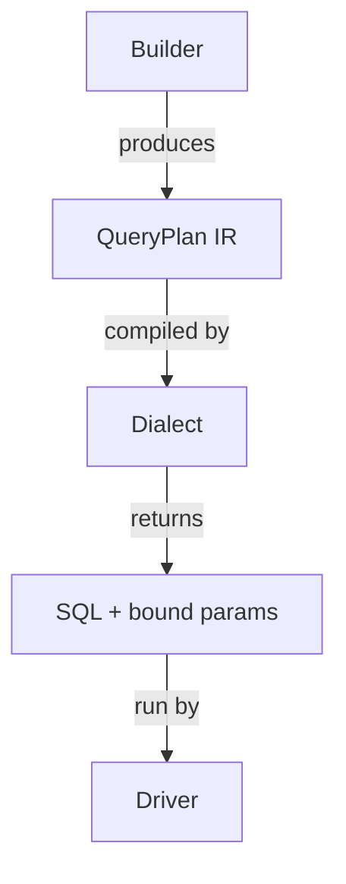
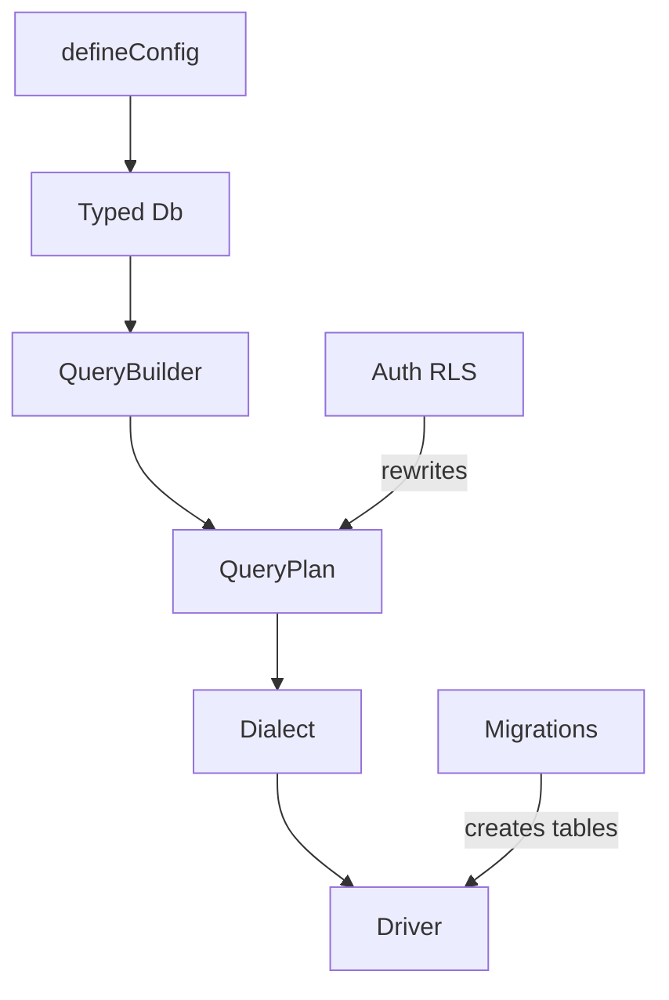

import { Aside } from '@astrojs/starlight/components';


MountSQLI has a small set of core ideas. Learn these and every package makes
sense.

## The ORM is a compiler

You do not instantiate rows. You describe a query, and MountSQLI **compiles** it.

```ts
const plan = db.from(users).where("age", ">", 18)._plan; // a plain data object
```

That `plan` is the **QueryPlan** — an intermediate representation (IR) of your
query. It is just data: selects, filters, joins, orders.

## QueryPlan IR

The `QueryPlan` is the contract every other part of the system speaks.




Because the plan is data, it is:

- **Immutable** — builder methods fork a new plan, never mutate the old one.
- **Serializable** — the AI package emits plans; RLS rewrites plans; the Studio
  inspects plans.
- **Driver-agnostic** — the same plan runs on SQLite, Postgres, or MySQL.

## Dialects

A **Dialect** turns a `QueryPlan` into SQL. The dialect decides parameter style:

- SQLite / MySQL use `?`
- Postgres uses `$1`, `$2`, …

```ts
compilePlan(plan, "postgres").sql;  // SELECT ... WHERE "age" > $1
compilePlan(plan, "sqlite").sql;    // SELECT ... WHERE "age" > ?
```

<Aside type="note" title="Injection-safe by construction">
`compilePlan` never concatenates values into the SQL string. Every value
becomes a bound parameter. This is a structural guarantee, not a lint rule.
</Aside>

## Drivers

A **Driver** translates `{ sql, params, columnTypes }` into rows. Drivers are
thin: no query logic, just transport. Adding a database means writing a
`Driver` + a `Dialect` — no query/IR code is duplicated.

| Package | Database |
| --- | --- |
| `@mountsqli/driver-sqlite` | SQLite (`node:sqlite`, zero deps) |
| `@mountsqli/driver-postgres` | Postgres (`pg`) |
| `@mountsqli/driver-mysql` | MySQL (`mysql2`) |

## RLS is enforced in the plan

Row-level security is **compiled into the QueryPlan** as filter nodes, not
applied in app code. A policy like "owner only" becomes a `WHERE user_id = ?`
injected before the query runs. This keeps `@mountsqli/query` free of
`@mountsqli/auth`, so `core` stays light.

## Config is the source of truth

`defineConfig({...})` is generic over your table tuple. Your app's `Db` type is
derived with `DbFromConfig<typeof config>` — no hand-written tuple, no `any`.

## How the pieces relate



## Best practices

- Think in plans, not rows. If you reach for a model instance, stop.
- Let the dialect own SQL differences; write one query, run on any driver.
- Keep RLS in policies, not in `where()` calls.

## Common mistakes

- Assuming `where()` runs SQL immediately — it builds a plan; `.all()`/`.findOne()` run it.
- Putting auth checks in handlers instead of RLS policies.

## Related

- [Architecture → How MountSQLI Works](/architecture/how-it-works/) — the internals.
- [QueryPlan IR](/architecture/queryplan/) — every node type.
- [Compiler & Dialects](/architecture/compiler/) — `compilePlan` in depth.
