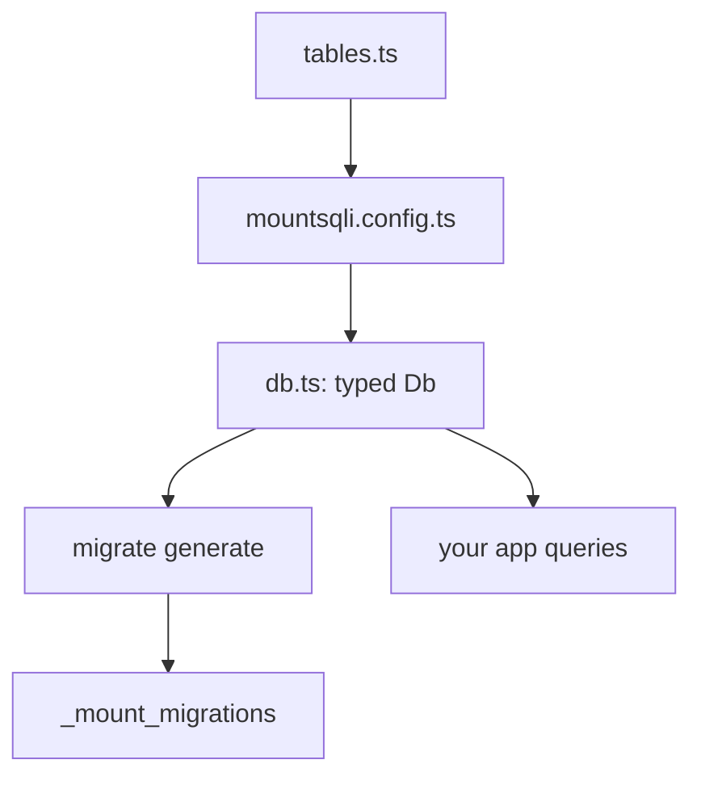

import { Aside, FileTree } from '@astrojs/starlight/components';


Quick Start showed one file. A real project uses a config file and migrations.
This guide builds that scaffold.

## Project layout

<FileTree>
- my-app/
  - mountsqli.config.ts
  - src/
    - db.ts
    - main.ts
  - package.json
</FileTree>

## 1. Define tables

```ts
// src/tables.ts
import { defineTable, int, text, timestamp } from "@mountsqli/core";

export const posts = defineTable("posts", {
  id: int().pk(),
  title: text().notNull(),
  body: text(),
  createdAt: timestamp().notNull().defaultNow(),
});
```

## 2. Write the config

`mountsqli.config.ts` is the single source of truth. The `Db` type is derived
from it — never hand-rolled.

```ts
// mountsqli.config.ts
import { defineConfig } from "@mountsqli/core";
import { posts } from "./src/tables";

export default defineConfig({
  driver: "sqlite",
  url: "./app.db", // file URL persists _mount_migrations
  tables: [posts],
});
```

## 3. Derive the typed Db

```ts
// src/db.ts
import { mountsqli, type DbFromConfig } from "@mountsqli/core";
import config from "../mountsqli.config";

export const db = mountsqli(config);
export type AppDb = DbFromConfig<typeof config>;
```

<Aside type="note" title="No manual tuples">
`DbFromConfig<typeof config>` infers the table list from the config. You never
write a tuple of table types by hand.
</Aside>

## 4. Generate and apply migrations

```bash
npx mountsqli migrate generate
npx mountsqli migrate apply
```

This creates `posts` and records the step in `_mount_migrations`.

## 5. Use it

```ts
// src/main.ts
import { db, posts } from "./db";

await db.from(posts).insert({ title: "Hello", body: "First post" });

const all = await db.from(posts).all();
console.log(all);
```

## Mermaid: project flow



## Best practices

- Keep tables in their own module and import them into the config.
- Commit `mountsqli.config.ts`; it is your schema of record.
- Use a file URL (not `:memory:`) so migrations persist between runs.

## Common mistakes

- Editing the table in code but forgetting `migrate generate` — the live DB drifts.
- Deriving `Db` by hand instead of `DbFromConfig` — you lose type accuracy.

## Related

- [Migrations → How Migrations Work](/migrations/how/) — diff, generate, apply.
- [Core Concepts](/getting-started/core-concepts/) — the config-as-source-of-truth model.
- [CLI → Commands](/cli/commands/) — every `mountsqli` subcommand.
