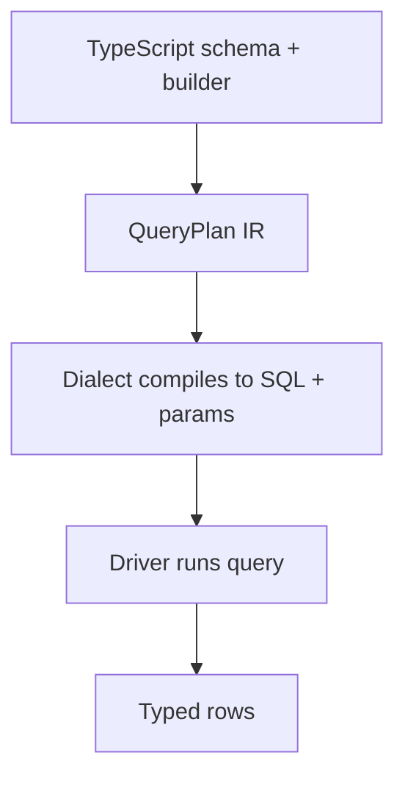

import { Aside } from '@astrojs/starlight/components';


MountSQLI is a **type-safe ORM and backend platform**. It gives you a
typed query builder, schema definitions, migrations, auth, an API layer,
storage, realtime, caching, and an AI assistant — all from one compiler.

## What is it?

Most ORMs are a **class hierarchy** over your database. You define models as
classes, and the library generates SQL at runtime. MountSQLI takes a different
bet:

> The ORM is a **compiler** plus an **intermediate representation (QueryPlan IR)**,
> not a class hierarchy.

You describe what you want in TypeScript. MountSQLI compiles that into a `QueryPlan`
(a plain data structure), then a **Dialect** turns the plan into SQL with bound
parameters. The database never sees string-concatenated values.

```ts
import { mountsqli, defineTable, int, text } from "@mountsqli/core";

const users = defineTable("users", {
  id: int().pk(),
  email: text().notNull(),
});

const db = mountsqli({ driver: "sqlite", url: ":memory:", tables: [users] });

const row = await db.from(users).where("email", "=", "a@b.c").findOne();
//      ^? { id: number; email: string } | null
```

## Why does it exist?

Other ORMs force a trade-off:

- **Prisma / TypeORM** are safe but heavy. They allocate object graphs per row and
  can't tree-shake.
- **Drizzle** is lighter and SQL-first, but still builds queries as chained method
  state.

MountSQLI keeps Drizzle's "native SQL first" feel while making the query a
**compiled, immutable data structure**. That unlocks edge deployments, near-zero
allocation, and a single validator that both you and an AI use.

## When should you use it?

Use MountSQLI when you want:

- End-to-end type safety from schema to result row.
- One tool for schema, queries, migrations, auth, API, and storage.
- SQL you can read, with injection safety by construction.
- AI-generated queries validated by the same compiler as yours.

<Aside type="caution" title="Not for raw DB administration">
MountSQLI is an application data layer. For one-off admin tasks, use your
database's own shell.
</Aside>

## How it works (the 30-second version)



The plan is the contract. Everything else — dialects, drivers, RLS, the AI
validator — reads or writes the same plan.

## Best practices

- Define tables once with `defineTable` and infer types with `InferTable`.
- Let the compiler catch bad column names and operators at build time.
- Prefer the builder over raw SQL; escape hatches exist but are guarded.

## Common mistakes

- Treating MountSQLI like an ActiveRecord ORM (it has no model instances).
- Hand-writing SQL strings instead of using the builder's raw-SQL helpers.

## Related

- [Why MountSQLI?](/getting-started/why-mountsqli/) — the design bets in depth.
- [Core Concepts](/getting-started/core-concepts/) — compiler, IR, dialects, drivers.
- [Quick Start](/getting-started/quick-start/) — run your first query.
