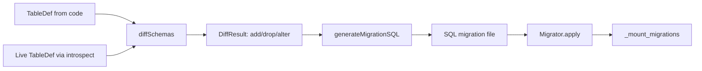

import { Aside } from '@astrojs/starlight/components';

Migrations in MountSQLI are **pure-then-applied**. Diffing and SQL generation are
pure functions over your `TableDef[]`; only the `Migrator` touches the database.

## The model

## Three pure functions

| Function | Input | Output |
| --- | --- | --- |
| `diffSchemas(before, after)` | two `TableDef[]` | `DiffResult` (changes) |
| `generateMigrationSQL(diff, dialect)` | a `DiffResult` | `GeneratedMigration` (SQL) |
| `introspect(driver)` | a live `Driver` | `TableDef[]` of the real DB |

## The migrations table

Applied steps are recorded in `_mount_migrations` on the database. This is the
source of truth for what has run.

- `migrate status` diffs the on-disk migration files against `_mount_migrations`
  to show pending work.
- `migrate apply` runs pending steps in a transaction and records each.

<Aside type="note" title="Status needs the known set">
`Migrator.status(knownSteps)` takes the on-disk migrations to compute `pending`.
With no argument, `pending` is empty (issue 004). The CLI always passes the
known steps.
</Aside>

## Why pure-first

- You can preview SQL before it runs (`generate` writes files, `apply` runs them).
- No generator daemon — diffing is a compiler phase, not a pre-run requirement.
- The same diff powers the Studio's drift report.

## Best practices

- Commit migration files to version control.
- Review generated SQL before applying to production.
- Use a file URL (not `:memory:`) so `_mount_migrations` persists.

## Common mistakes

- Editing a table in code but skipping `migrate generate` — the live DB drifts.
- Deleting a migration file that was already applied — status reports it missing.

## Related

- [Generate](/migrations/generate/) — `migrate generate`.
- [Apply](/migrations/apply/) — `migrate apply`.
- [Status](/migrations/status/) — `migrate status`.
