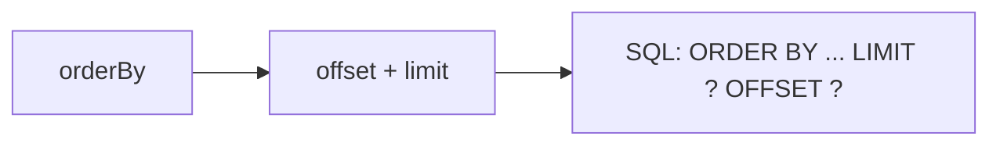

Order and page results with `orderBy`, `limit`, `offset`, and `paginate`.

## Order by

```ts
db.from(users).orderBy("createdAt", "desc").all();
db.from(users).orderBy("email", "asc").all();
```

Chain multiple `orderBy()` calls for a multi-key sort:

```ts
db.from(users).orderBy("age", "desc").orderBy("email", "asc").all();
```

## Limit

```ts
db.from(users).limit(10).all(); // first 10 rows
```

## Offset

```ts
db.from(users).limit(10).offset(20).all(); // rows 21–30
```

## Paginate

`paginate(page, pageSize)` is sugar for `offset((page - 1) * pageSize).limit(pageSize)`:

```ts
const page2 = await db.from(users).paginate(2, 10).all();
// equivalent to offset(10).limit(10)
```

## Distinct

`.distinct()` removes duplicate rows:

```ts
db.from(posts).select("authorId").distinct().all();
```

## Real-world example

A paginated, newest-first list:

```ts
export async function recentUsers(page: number) {
  return db
    .from(users)
    .orderBy("createdAt", "desc")
    .paginate(page, 25)
    .all();
}
```

## Mermaid: pagination flow



## Best practices

- Always `orderBy` before paginating — offset without order is unstable.
- Use `paginate()` for page numbers; use `limit/offset` for cursors.
- Add an index on the order column for large tables.

## Common mistakes

- Paginating without `orderBy` — rows can shift between pages.
- Using 0-based page numbers with `paginate` (page 1 is the first page).

## Related

- [Select](/query-builder/select/) — running the query.
- [Filtering](/query-builder/filtering/) — filter before you sort.
