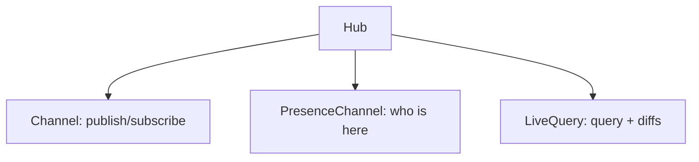

`@mountsqli/realtime` adds live behavior on top of your data: a `Hub` of
`Channel`s, `PresenceChannel` for who's online, and `LiveQuery` for query results
that update as data changes.

## Pieces

| Class | Role |
| --- | --- |
| `Hub` | owns channels, presence rooms, live queries |
| `Channel` | pub/sub by name |
| `PresenceChannel` | tracks members in a room |
| `LiveQuery` | re-runs a query on change and pushes diffs |

## How it fits

## Why in-process pub/sub?

The `Hub` is an in-process message bus — fast, no network. The `mountsqli dev`
server exposes it over SSE (`/live/<channel>`) so browsers can subscribe.

## Best practices

- Use `LiveQuery` for dashboards that must reflect writes immediately.
- Use `PresenceChannel` for "who's online" without polling.
- Unsubscribe (`Unsubscribe`) when a client disconnects.

## Common mistakes

- Assuming the `Hub` spans processes — it's in-process; use an external bus for multi-instance.
- Forgetting to unsubscribe — leaks subscribers.

## Related

- [Presence](/realtime/presence/) — track members.
- [Live Queries](/realtime/live-queries/) — reactive results.
