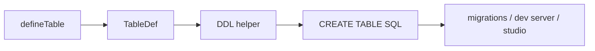

import { Aside } from '@astrojs/starlight/components';


DDL (Data Definition Language) is the `CREATE TABLE` SQL generated from your
`TableDef`. MountSQLI generates it from the same definition used at runtime, so
the schema and the migrations never disagree.

## How it works

`defineTable` produces a `TableDef` (plain data). A shared helper turns that
into a dialect-specific `CREATE TABLE` statement. Migrations, the dev server,
and the Studio all call this helper — there is one code path.



## What is generated

For each column: name, type (dialect-mapped), `NOT NULL`, `PRIMARY KEY`,
`UNIQUE`, `DEFAULT`, `REFERENCES`, and `CHECK`. Table-level options become
composite constraints.

```ts
const users = defineTable("users", {
  id: int().pk(),
  email: text().notNull().unique(),
  active: bool().notNull().default(true),
});
// CREATE TABLE "users" (
//   "id" INTEGER PRIMARY KEY,
//   "email" TEXT NOT NULL UNIQUE,
//   "active" INTEGER NOT NULL DEFAULT 1
// )
```

<Aside type="note" title="Booleans are 1/0 in DDL">
`bool().default(true)` emits `DEFAULT 1`, matching the 0/1 storage invariant.
The driver decodes `1` → `true` on read.
</Aside>

## Where DDL is used

| Consumer | Purpose |
| --- | --- |
| `migrate generate` | writes `CREATE TABLE` into a migration file |
| `mountsqli dev` | creates tables on first run |
| Studio | shows the live schema and ERD |
| `introspect` | compares live DB to your definitions |

## Dialect differences

The DDL helper uses the active dialect for type names and quoting:

- SQLite: `INTEGER`, `TEXT`, double-quoted identifiers.
- Postgres: `INTEGER`, `TEXT`, `$N` is not used in DDL (no params there).
- MySQL: `INT`, `VARCHAR`, backtick quoting.

## Best practices

- Treat `mountsqli.config.ts` as the schema of record; let DDL be derived.
- Review generated DDL in a migration before applying it.

## Common mistakes

- Hand-writing `CREATE TABLE` in a migration — use `migrate generate` instead.
- Expecting `bool()` to emit `TRUE`/`FALSE` — it emits `1`/`0`.

## Related

- [Migrations → How Migrations Work](/migrations/how/) — diff + generate.
- [Drivers](/drivers/overview/) — dialect-specific type names.
